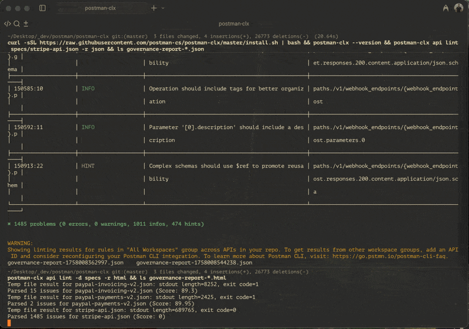

# Postman CLX - An Enhanced Postman CLI *with Governance Reporers!*



Drop-in replacement for Postman CLI that adds useful governance reporting. Add `-r json` or `-r html` to any lint command for detailed analysis beyond standard CLI output. Runnable on single specs or entire directories and workspaces for comprehensive multi-API reporting (the HTML reports are pretty, too).

Adapted from the ADO Pipelines and Github Actions Workflows [here](https://github.com/postman-cs/governance-demo), now just natively integrated.

## Installation

```bash
# Unix/Linux/macOS
curl -sSL https://raw.githubusercontent.com/postman-cs/postman-clx/master/install.sh | bash

# Windows PowerShell
iwr -useb https://raw.githubusercontent.com/postman-cs/postman-clx/master/install.ps1 | iex
```

## Usage

```bash
# Generate governance reports (new functionality)
postman-clx api lint -d ./specs -r html          # Interactive dashboard
postman-clx api lint ./spec.yaml -r json         # CI/CD automation
postman-clx spec lint spec-id -r html            # Postman workspace analysis

# Standard Postman CLI (unchanged)
postman-clx collection run collection-id
postman-clx api lint ./spec.yaml
```

**JSON Reports** (`-r json`): Machine-readable data for CI/CD pipelines and automated quality gates. **HTML Dashboards** (`-r html`): Interactive web interface with filtering and visual analysis for team collaboration.

## CI/CD Integration

```yaml
# GitHub Actions example
- name: Install Enhanced Postman CLI
  run: curl -sSL https://raw.githubusercontent.com/postman-cs/postman-clx/master/install.sh | bash

- name: API Governance Check
  run: postman-clx api lint -d ./specs -r json
```

Complete backward compatibility with existing Postman CLI workflows. Only lint commands gain the optional `-r` flag.

## Manual Installation

[GitHub releases](https://github.com/postman-cs/postman-clx/releases) provide pre-built compressed binaries for all platforms. Stable and canary channels available.

## Building from Source

```bash
./build-binary.sh                    # All platforms
./build-binary.sh --arch osx_arm64   # Specific platform
```

Requires Rust toolchain. The enhanced CLI embeds the original Postman CLI with governance analysis through command interception.